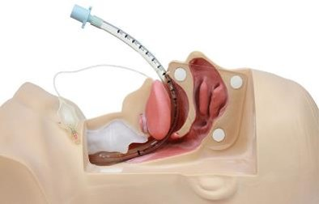
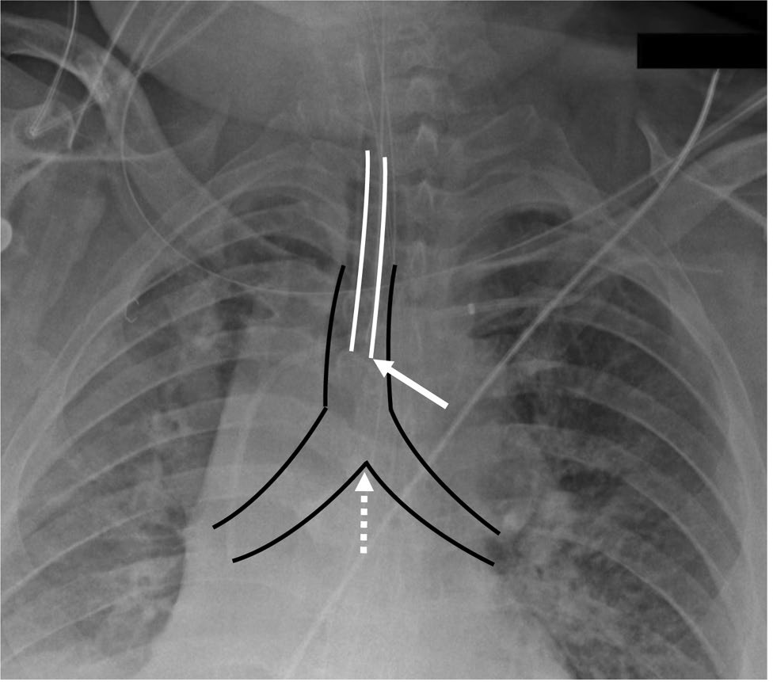
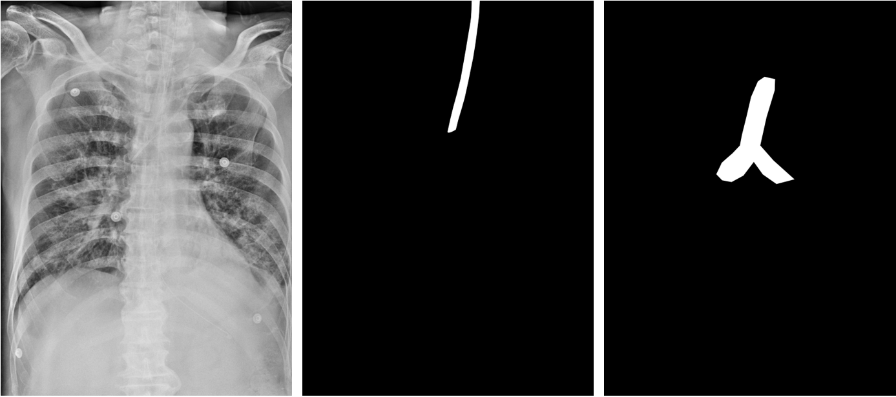
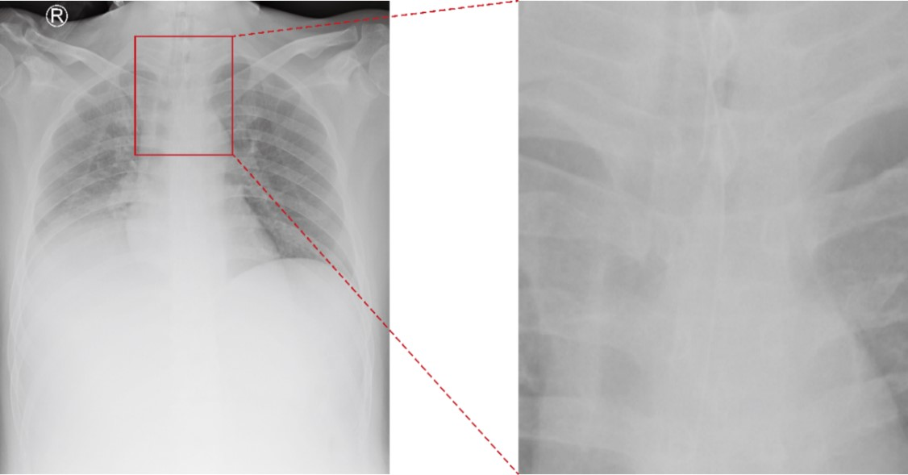
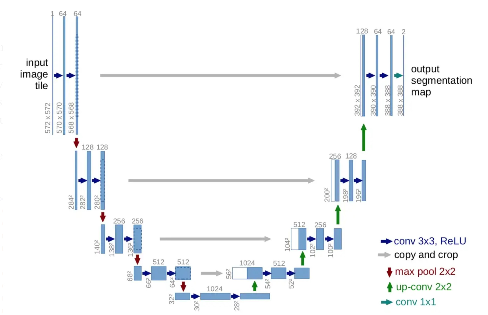
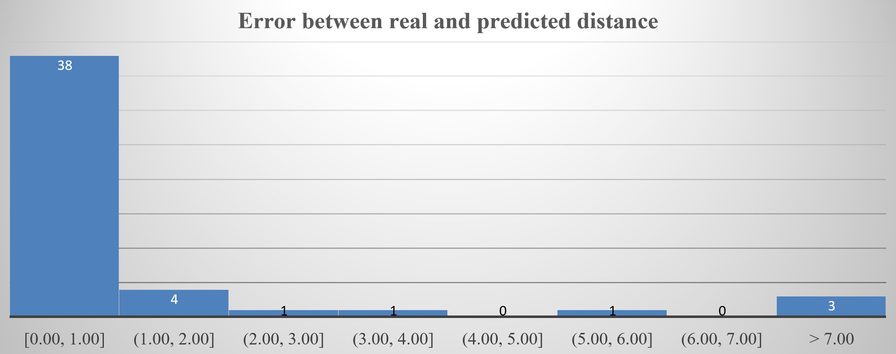

# 🫁 Endotracheal Tube (ETT) and Carina Segmentation using Deep Learning

---

## 🧠 **Background**

An **endotracheal tube (ETT)** is a flexible plastic airway device inserted through the mouth into the trachea and connected to a breathing machine to provide mechanical ventilation to the lungs.

<p align="center">
    
</p>

- Optimal ETT positioning is essential for effective ventilation and patient safety.  
- The tube tip should ideally be **5 ± 2 cm above the carina**, the point where the trachea divides into the main bronchi.  
- ETT positioning is typically evaluated using **frontal chest radiographs**.  
- However, due to high clinical workloads, the **average turnaround time (TAT)** for radiographic ETT assessment can reach **~23 minutes**, delaying treatment decisions.

---

## 🎯 **Objective**

> ⚕️ Develop an **automated, accurate, and objective tool** for the detection and localization of the **ETT** and **Carina** on chest radiographs.

Such a system can:
- Assist radiologists by providing rapid localization feedback.
- Reduce clinical turnaround time.
- Prevent critical misplacement of ETTs.

<p align="center">
    
</p>

---

## ⚙️ **Implementation Workflow**

This repository includes the **first four stages** of a full ETT–Carina detection pipeline.

| Stage | Description |
|--------|--------------|
| **1. Load Dataset** | Import and organize X-ray images |
| **2. Pre-processing** | Resize, normalize, augment data |
| **3. ETT Segmentation** | Detect ETT using U-Net |
| **4. Carina Segmentation** | Detect Carina using U-Net |
| **5. Distance Calculation** | (To be added) Compute ETT–Carina distance |

---

## 🖼️ **Sample Images**

<p align="center">
    
</p>

---

## 🧩 **Step 2: Pre-processing**

Preprocessing improves model robustness and generalization using:

- **Data Augmentation:**  
  - Horizontal Flip  
  - Shift, Scale, Rotate  
  - CLAHE (Contrast Limited Adaptive Histogram Equalization)

- **Cropping:**  
  Focus on relevant thoracic regions to reduce background noise.

<p align="center">
    
</p>

---

## 🧠 **Step 3: ETT Segmentation using U-Net**

The **U-Net** architecture is a fully convolutional encoder–decoder network designed for biomedical image segmentation.  
It combines low-level spatial features with high-level semantic information through skip connections.

<div align="center">
    <h4> U-Net Structure</h4>
</div>

<p align="center">
    
</p>

---

## 🩻 **Step 4: Carina Segmentation using U-Net**

The same U-Net structure is used for **Carina segmentation**, trained on separate labeled datasets.

This allows the model to detect:
- The branching point of the trachea (carina).
- The position of the ETT tip in relation to the carina for distance estimation.

---

## 📏 **Step 5: Distance Calculation (Planned Extension)**

After segmentation, the **Euclidean distance** between the ETT tip and the Carina center is calculated as:

$$
d(p, q) = \sqrt{(x_1 - x_2)^2 + (y_1 - y_2)^2}
$$


where:  
- $p = (x_1, y_1)$ → ETT tip location  
- $q = (x_2, y_2)$ → Carina location

This metric can be later converted into **centimeters** using pixel spacing information.

---

<div align="center">
    <h4>✅ Final Result Example</h4>
</div>

<p align="center">
    
</p>

---

## 📂 **Repository Structure**
<pre><code>
ETT_Carina_Segmentation/
│
├── config/
│ ├── carina_config.yaml # Configuration for Carina segmentation
│ └── ett_config.yaml # Configuration for ETT segmentation
│
├── data/
│ ├── carina_v2/ # Carina dataset
│ └── ett_v2/ # ETT dataset
│
├── results/
│ ├── carina/ # Model results and visualizations
│ └── ett/ # ETT localization results
│
├── src/
│ ├── models/
│ │ └── model_factory.py # Model builder (U-Net++, U2Net, etc.)
│ │
│ ├── utils/
│ │ ├── dataset.py # Data loading and augmentation
│ │ ├── losses.py # Dice, BCE, Focal loss
│ │ ├── metrics.py # IoU, Dice metrics
│ │ ├── postprocess.py # Post-processing utilities
│ │ ├── trainer.py # Training and validation loops
│ │ └── visualization.py # Visualization and comparison tools
│ │
│ └── main.py # Main training script
│
├── requirements.txt # Dependencies
└── README.md # Project documentation
</code></pre>

---

## 🧮 **Technical Specifications**

- **Framework:** PyTorch  
- **Model:** U-Net / U-Net++  
- **Loss Function:** Dice + Binary Cross-Entropy (BCE)  
- **Metrics:** IoU, Dice Coefficient  
- **Augmentation:** Albumentations & ImgAug  
- **Visualization:** Matplotlib & OpenCV  
- **Optimizer:** Adam  

---

## 💻 **Dependencies**

torch
torchvision
segmentation-models-pytorch
albumentations
imgaug
opencv-python
numpy
matplotlib
pandas
pyyaml
scikit-learn


Install all dependencies using:
```bash
pip install -r requirements.txt
```
---

---

## 📂 Data Availability

The raw data supporting the conclusions of this study will be **made available by the authors upon reasonable request**, without undue reservation.  
Please contact the author for data access and research collaboration inquiries.

---

## 🧩 Citation

If you use this work or code in your research, please cite our paper:

> **A Robust Approach for Endotracheal Tube Localization in Chest Radiographs**  
> *Chung-Chian Hsu, Rasoul Ameri, Chih-Wen Lin, Jia-Shiang He, Meghdad Biyari, Atefeh Yarahmadi, Shahab S. Band, Tin-Kwang Lin, Wen-Lin Fan*  
> *Frontiers in Artificial Intelligence, 2023, Vol. 6:1181812*  
> [https://doi.org/10.3389/frai.2023.1181812](https://doi.org/10.3389/frai.2023.1181812)

```bibtex
@article{hsu2023robust,
  title={A robust approach for endotracheal tube localization in chest radiographs},
  author={Hsu, Chung-Chian and Ameri, Rasoul and Lin, Chih-Wen and He, Jia-Shiang and Biyari, Meghdad and Yarahmadi, Atefeh and Band, Shahab S and Lin, Tin-Kwang and Fan, Wen-Lin},
  journal={Frontiers in Artificial Intelligence},
  volume={6},
  pages={1181812},
  year={2023},
  publisher={Frontiers Media SA}
}
```
## 📫 Contact

**Rasoul Ameri**  
📧 [rasoulameri90@gmail.com](mailto:rasoulameri90@gmail.com)  
🔗 [GitHub Profile](https://github.com/rasoulameri)

